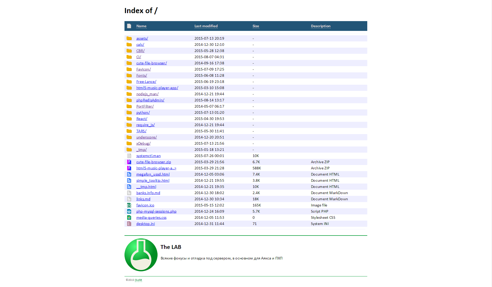

# Apache-Fancy-Index

Apache directory index fresh look

Most magic in `extra/httpd-autoindex.conf`. Put'em into your Apache's `conf` dir:

- **Windows:** `<Apache dir>/conf`. 

- **LINUX:** `/etc/httpd/conf.d/`. Rename `*.conf` file (truncate starting `httpd-`).

Don't forget correct pathes in `*.conf` file. In my configuration on Windows Apache is installed
at `C:\CLI\Apache24\`, and folders `icons` and `include` are placed under that path, but on your
system you may place `icons` and `*.css` file were you like, but in `*.conf` file you must
describe that path with `Alias` directives and specify **exact** path to your directories in `<Directory>` blocks.

Note, that almost 70% of types described in this `conf` is newly declared 
or declared in diffrent way then original `autoindex.conf`~

Note that in cpecs README files are described. You may see some additional info under the directory table in sample
picture: this info is taken from README file, which not listed in directory table (see `conf`).

Братцы, не обижайтесь, что буржуинам все расписываю, а по-русски не очень: кто чуточку дорос до этих фишек, тот уже все понял,
а остальным это баловство лучше не трогать :)

Для тех, кто в теме: внимательно читайте содержимое `autoindex.conf` и аккуратно правьте, куда положить его и остальные файлы
сами знаете. Я в вас верю, пусть интернет станет чуть краше. Успехов.

# Licence

Licence: 
* Apache, http://www.apache.org/licenses/
* MLL, https://github.com/SynCap/MLL